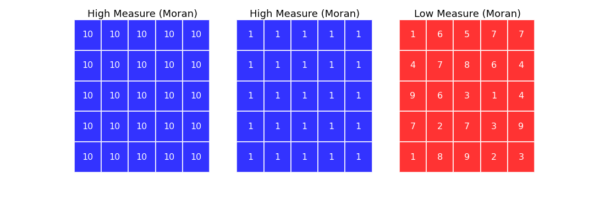

## Thank You

+ School of Public Affairs
+ Members of the Committee
+ Friends (in case anyone showed up for a nap)
+ Family
+ Last, and most importantly, Angela

  

---

## Plan of Attack

+ Research Motivation
+ Operating Context
+ Why are TELs such a fixture? (*SPOILER ALERT*)

  

---

## Tax and Expenditure Limitations

TELs provide a remarkably useful lens for viewing the intersection of rules and economic outcomes.  They are constraints, over and above the common set of rules that serve as a common denominator when we think about economic policy in the US.  Insofar as these rules vary, their impacts beg to be explored.  In much same way as learning a second language teaches one more about one's first language, the exploration of this variance teaches us about what we have already implicitly accepted.

That was heavy. What exactly are we looking at again?
+ Do TELs successfully depress revenue?
+ DO TELs make counties change how they spend public funds?
+ How can local fiscal managers adapt?

---

## This All Sounds Awfully Familiar...

...please tell me something new is being brought to the table.

+ Counties are far from identical, why pretend they are if we don't have to?
+ “[T]he first law of geography: everything is related to everything else but near things are more related than distant things.” (Tobler 1979)
+ Overlapping policies can interact in complex ways.
+ This study views models as observations.

---

## How Do the Pieces Fit Together?

1. TELs impose artificial barriers in the fiscal matching process.
2. Revenue growth that lags expenditure need decreases the ability to satisfy constituent preferences.
3. Failing to serve constituents is unlikely to help make a jurisdiction attractive for siting purposes.

Effective strategies for local fiscal managers require good intel.  This study scratches the surface.

---

## TEL Literature Landscape

Most of the empirical work attempts to study TELs across states, and as such, focuses on statewide definitions of TELs. Obviously this covers up local variation, but perhaps more interestingly, this choice in geographic scope encourages certain types of questions. 

+ What is the impact of TELs on revenue volatility ([St. Clair 2012](http://papers.ssrn.com/sol3/papers.cfm?abstract_id=2151690))? 
+ Do TELs constrain property taxes ([Dye & McGuire 1997](http://www.sciencedirect.com/science/article/pii/S0047272797000479))? 
+ Do TELs constrain growth in employment and wages ([Poterba & Rueben 1995](http://www.jstor.org/discover/10.2307/2117953?uid=3739256&uid=2&uid=4&sid=21102688756161))?
+ Does the impact of TELs on property revenue change during recessions (Mullins & Mikesell 2013)?

Evaluating the impact of TELs with a local lens begs the question, *are some jurisdictions affected differently than others*? While St. Clair did utilize local government data, the purpose was to show a general effect.  [Mullins (2004)](http://onlinelibrary.wiley.com/doi/10.1111/j.0275-1100.2004.00350.x/abstract?deniedAccessCustomisedMessage=&userIsAuthenticated=false), by contrast, is an important example of evaluating the *differential* impact of TELs as a function of socioeconomic starting conditions.

This study seeks to extend this approach by incorporating spatial and temporal dependency.

---

## Why Colorado?

+ Variation, variation, variation
  + Widely regarded as having one of the most restrictive TEL regimes in the country
  + Policy overlap is a significant feature
  + "DeBrucing" is a double edged sword

  

---

## TABOR *And Company*

While the Taxpayer's Bill of Rights (TABOR) gets the lion's share of attention in Colorado, it is but one component of a set of four overlapping policies.  In order of enactment:

1. **General Statewide Limit on Property Tax Revenue (SLPTR):**  Local property tax revenues may not increase by more than 5.5% in a given year (the limit was 7% before 1988)
2. **Gallagher Amendment (GA):** Assessment rates for residential property are set statewide, calculated to keep historical ratios of residential and non-residential property tax revenue consistent (with some minor space for modification)
3. **Taxpayer Bill of Rights (TABOR):** Limits annual growth in revenues to inflation plus a measure of growth (new construction for local governments and enrollment for school districts)
4. **Amendment 23 (A23):** Mandates minimum increases in school funding and removes a portion of revenue from the TABOR base

Yes, the interactions create modeling difficulties, but they also happen to provide *temporal variation* in the restrictiveness of the TEL structure.

---

## And De-Brucing is ...?

Local governments reserve the right to waive the requirements of both TABOR and the SLPTR.  Over the 1993-2011 period, 48 counties chose to exempt themselves from one or both restrictions.  This has provided *cross-sectional variation* ... and methodological complexity. 

  

---

## How Do We Account for Variation in Impact?

An ideal intensity score would capture three characteristics of any given county at time $t$:

1. The cumulative impact of statewide legislation over time;
2. The proliferation of locally derived exemptions from TABOR and SLPTR; and,
3. The local economic dynamics that may trigger a breach in the ceilings imposed by the aforementioned legislation.

This requires abstraction to modeling the implications of policy rather than the policy itself.  An estimate of the gap between revenue potential and the revenue yield permitted by the policies acting on county $i$ at time $t$ satisfies these requirements with a *continuous* measure.

---

## Empirical Justification for the Measure

  

  

---

## Modeling the Gallagher Amendment

Insofar as it is a limit based upon statewide characteristics, the Gallagher Amendment is a different animal altogether.  It is modeled as a separate variable.

  

To the extent that the residential share in a given county is higher than the statewide average, that county is constrained below its property tax revenue potential.

---

## Spatial Considerations

Industrial bases and socioeconomic conditions do not abruptly shift out of respect for the county border.  Counties can and do share similarities with their neighbors.  Spatial autocorrelation is real.  Enter Local Indicators of Spatial Association (LISAs; [Anselin 1995](http://onlinelibrary.wiley.com/doi/10.1111/j.1538-4632.1995.tb00338.x/abstract)):

#### Local Moran's $I_i$

$$I_i=\frac{\sum_j z_i w_{i,j} z_j}{\sum_i z_i^2}=\frac{\sum_j (y_i-\bar y)w_{i,j}(y_j-\bar y)}{\sum_i(y_i-\bar y)^2}$$

#### Getis & Ord's $G_i$

$$G_i(d)=\frac{\sum_j w_{i,j} (d) y_j - W_i \bar y(i)}{s(i)\{[(n-1) S_{1i} - W_i^2]/(n-2)\}^{(1/2)}},j \neq i$$

--- 

## Spatial Autocorrelation vs Temporal Autocorrelation

Temporal autocorrelation is often spoken of in terms of process memory.  The observation in time $t$ will exhibit a given relationship with the observation in time $t-1$ because the DGP carries the latent effect of that previous observation.  It "remembers" the last value or values, and behaves in a manner consistent with that knowledge.  

  

Spatial autocorrelation, insofar as it incorporates information about observations in the local neighborhood, is basically doing the same thing.  The difference is that temporal autocorrelation reflects uni-directional memory, while spatial autocorrelation reflects multi-dimensional memory.  

---

## Unpacking Measures of Spatial Autocorrelation

Local Moran's I and Getis & Ord's G* are complementary measures, insofar as they measure two different types of clustering.  Local Moran's I highlights pockets of similarity and disimilarity while Getis & Ord's G* highlight pockets of high and low values.

  

  

---

## What is the Local Neighborhood?

Defining the local neighborhood is somewhat analagous to defining the memory structure in an autoregressive process.

>"[W]hile there have been significant advances in the spatial econometrics literature in the last 20 years, the key issue involved from the very start (the specification of the W-matrix and the form of spatial spillovers more generally) remains largely unsolved." ([Harris & Kravtsova 2009](http://www.ub.edu/sea2009.com/Papers/100.pdf))

>"...what is the theoretical and empirical basis of assumptions about the spatial reach of externalities, and how can this be enhanced?" ([Fingleton 2003](http://irx.sagepub.com/content/26/2/197.abstract))

---

## REVENUE

Do TELs *Lead to Convergence in* Revenue Yield and Fiscal Capacity?
+ Ratcheting 
+ Investment

Do TELs *Depress* Revenue Yield and Fiscal Capacity?
+ Growth Ceiling
+ Investment (again)

---

## How Can These Concepts Be Measured?

+ **Revenue Yield** ($pcrev$) captures realized county resources for each constituent; and,
+ **Fiscal Capacity** ($pcap$) captures potential county resources for each constitutent.

The latter utilizes per capita annual payroll instead of per capita income because payroll is spatially contained by the county in question.  Thus, there is a more direct tie to local fiscal operations (though not perfect).

---

## What is Contained in the Revenue Model Ensemble?

***
---

## Assessment to Sales Ratio

  

---

## Weight Matrices

  

  

