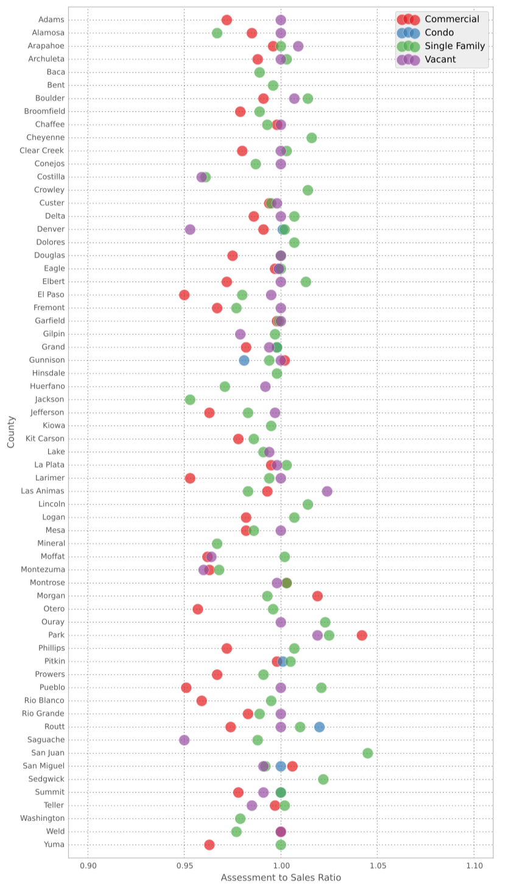
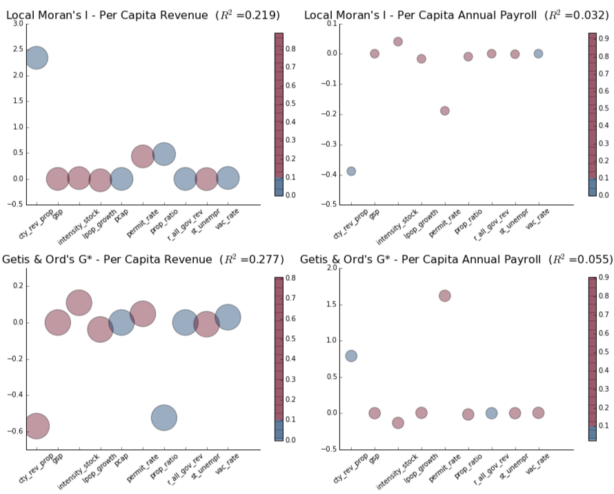
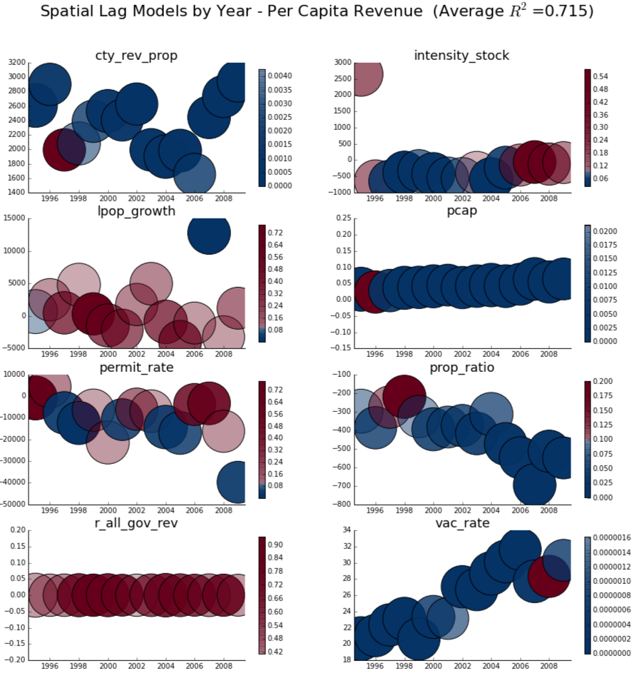
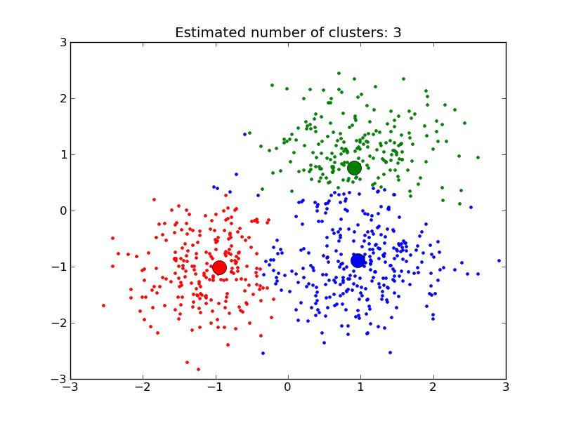
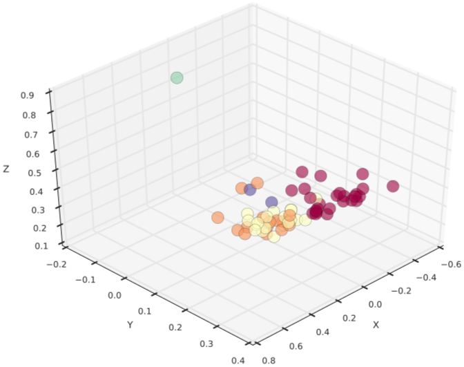
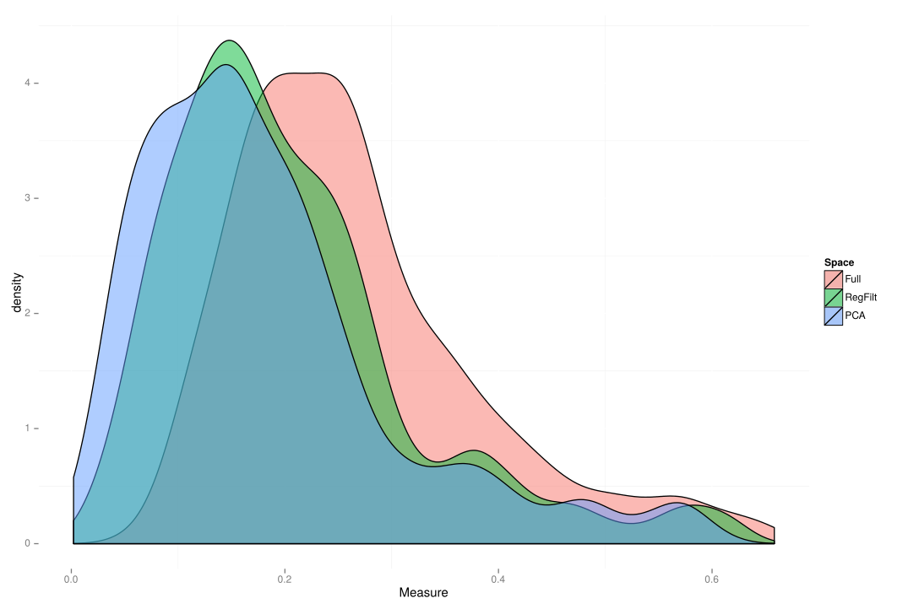
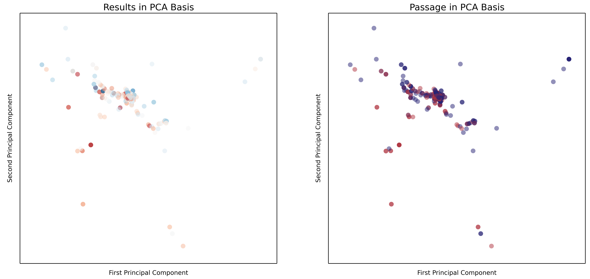

## Plan of Attack

&rarr; High-Level View 
&rarr; Operating Context 
&rarr; Space 
&rarr; Why are TELs such a fixture? 
&rarr; Q & A

 
 
SPOILER ALERT: This study does not test propositions about why TELs have become a fixture, which is only a motivating question.  It does, however, ask related questions about TEL impacts and when counties choose to opt out.

---

## Plan Status

&rarr; High-Level View 
&rarr; Operating Context 
&rarr; Space 
&rarr; Why are TELs such a fixture? 
&rarr; Q & A

  

---

## Tax and Expenditure Limitations

TELs provide a remarkably useful lens for viewing the intersection of rules and economic outcomes.  They are constraints, over and above the common set of rules that serve as a common denominator when we think about economic policy in the US.  Insofar as these rules vary, their impacts beg to be explored.  In much the same way as learning a second language teaches one more about one's first language, the exploration of this variance teaches us about what we have already implicitly accepted.

That was heavy. What exactly are we looking at again?
+ Do TELs successfully depress revenue?
+ Do TELs make counties change how they spend public funds?
+ How can local fiscal managers adapt?

---

## Punchline

|DOES THIS STUDY FIND THAT COTELs...|COTEL Intensity|Gallagher Ratio
|:-----------|---------------|---------------
|...increase fiscal clustering?|NO|YES
|...depress revenue yield?|YES|YES
|...depress economic capacity?|NO|NO
|...change expenditure behavior?|NO*|NO
|...increase chances of deBrucing success?**|NO|YES
 
*COTELs actually decrease the variation in expenditure choices within county type.
 
**Basic socioeconomic chacteristics are a far better predictor.
 

Note that this study uses a model ensemble approach.  Some of the negative findings are due to statistically insignificant results, while others are due to a high degree of conflict across models.

---

## Hasn't the TEL Impact Thing Been Done?

Please tell me something new is being brought to the table...

+ Counties are far from identical, why pretend they are if we don't have to?
+ “[T]he first law of geography: everything is related to everything else but near things are more related than distant things.” (Tobler 1979)
+ Overlapping policies can interact in complex ways.
+ This study views individual models as observations (hence the model ensemble approach).

---

## How Do the Pieces Fit Together?

1. TELs impose artificial barriers in the fiscal matching process.
2. Revenue growth that lags expenditure need decreases the ability to satisfy constituent preferences.
3. Failing to serve constituents is unlikely to help make a jurisdiction attractive for siting purposes.

Effective strategies for local fiscal managers require good intel.  This study scratches the surface.

---

## TEL Literature Landscape

Most of the empirical work attempts to study TELs across states, and as such, focuses on statewide definitions of TELs. Obviously this masks local variation, but perhaps more interestingly, this choice in geographic scope encourages certain types of questions. 

+ What is the impact of TELs on revenue volatility ([St. Clair 2012](http://papers.ssrn.com/sol3/papers.cfm?abstract_id=2151690))? 
+ Do TELs constrain property taxes ([Dye & McGuire 1997](http://www.sciencedirect.com/science/article/pii/S0047272797000479))? 
+ Do TELs constrain growth in employment and wages ([Poterba & Rueben 1995](http://www.jstor.org/discover/10.2307/2117953?uid=3739256&uid=2&uid=4&sid=21102688756161))?
+ Does the impact of TELs on property revenue change during recessions (Mullins & Mikesell 2013)?

Evaluating the impact of TELs with a local lens begs the question, *are some jurisdictions affected differently than others*? While St. Clair did utilize local government data, the purpose was to show a general effect.  [Mullins (2004)](http://onlinelibrary.wiley.com/doi/10.1111/j.0275-1100.2004.00350.x/abstract?deniedAccessCustomisedMessage=&userIsAuthenticated=false), by contrast, is an important example of evaluating the *differential* impact of TELs as a function of socioeconomic starting conditions.

This study seeks to extend this approach by incorporating spatial and temporal dependency.

---

## In Case We Want to Get Into the Weeds...

&diams; Strong TELs have a cumulative depressive effect on revenue (Mikesell & Mullins 2008) 
&diams; TELs degrade educational labor supply (Figlio & Rueben 2001) 
&diams; TELs may lower student performance (Downes et al 1998; Downes & Figlio 1999) 
&diams; TELs increase reliance on non-tax revenue (Joyce & Mullins 1991;Eberts & Gronberg 1981) 
&diams; TELs increase reliance on state funding for local services (Sokolow 1998; Sokolow 2000; Shadbegian 2003) 
&diams; TELs are often motivated by distrust of officials and belief in rampant waste (Cutler et al 1999) 
&diams; Residents often resent service cuts due to TELs (Cutler et al 1999) 
&diams; States with higher property taxes are more likely to pass TELs (Alm & Skidmore 1999) 
&diams; TELs depress property tax revenue (Shadbegian 1998; Rown 2000; Dye & McGuire 1997) 
&diams; Offsetting the revenue loss from TELs is more difficult with more stringent TELs (Shadbegian 1999) 
&diams; The impact of TELs varies widely across jurisdictions (Bradbury et al 2001; Rown 2000; Mullins 2004) 
&diams; TELs depress local spending (Shadbegian 1998; Bails & Tieslau 2000; Feld & Matsusaka 2003) 
&diams; TELs reduce housing stock value by limiting the extent of educational service capitalization (Bradbury et al 2001) 

---

## Plan Status

&rarr; High-Level View 
&rarr; Operating Context 
&rarr; Space 
&rarr; Why are TELs such a fixture? 
&rarr; Q & A

  

---

## Why Colorado?

+ Variation, variation, variation
  + Widely regarded as having one of the most restrictive TEL regimes in the country
  + Policy overlap is a significant feature
  + "DeBrucing" is a double edged sword

  

---

## TABOR *and Company*

While the Taxpayer's Bill of Rights (TABOR) gets the lion's share of attention in Colorado, it is but one component of a set of four overlapping policies.  In order of enactment:

1. General Statewide Limit on Property Tax Revenue (SLPTR):  Local property tax revenues may not increase by more than 5.5% in a given year
2. Gallagher Amendment (GA): Assessment rates for residential property are set statewide, calculated to keep historical ratios of residential and non-residential property tax revenue consistent (with some minor space for modification)
3. Taxpayer Bill of Rights (TABOR): Limits annual growth in revenues to inflation plus a measure of growth (new construction for local governments and enrollment for school districts)
4. Amendment 23 (A23): Mandates minimum increases in school funding and removes a portion of revenue from the TABOR base

Yes, the interactions create modeling difficulties, but they also happen to provide temporal variation in the restrictiveness of the TEL structure.

---

## Timeline

1913: State-level property taxes limited to 15% annual growth. 
1964: Local property taxes limited to 5% annual growth (SLPTR). 
1976: SLPTR increased to 7%. 
1977: State General Fund Appropriations limited to 7%, with 4% reserve required (Kadlecek Amendment). 
1979: Kadlecek Amendment made permanent. 
1982: Gallagher Amendment passed to hold constant the statewide residential share of property tax burden. 
1984: Kadlecek limit increased to 7% plus costs of reappraisals. 
1988: SLPTR limit reduced to 5.5%. 
1991: State General Fund Appropriations limited to lesser of 5% of growth in state income or 6% over appropriations in the preceding year (Arveshoug-Bird Limit). 
1992: TABOR amendment passed. 

---

## And De-Brucing is ...?

Local governments reserve the right to waive the requirements of both TABOR and the SLPTR.  Over the 1993-2011 period, 48 counties chose to exempt themselves from one or both restrictions.  This has provided cross-sectional variation ... and methodological complexity. 

  

---

## "The" Douglas Bruce

  

---

## Operationalizing COTEL Impact

An ideal intensity score would capture three characteristics of any given county at time $t$:

1. The cumulative impact of statewide legislation over time;
2. The proliferation of locally derived exemptions from TABOR and SLPTR; and,
3. The local economic dynamics that may trigger a breach in the ceilings imposed by the aforementioned legislation.

This requires abstraction to model the implications of policy rather than the policy itself.  An estimate of the gap between revenue potential and the revenue yield permitted by the policies acting on county $i$ at time $t$ satisfies these requirements with a continuous measure.

---

## Empirical Justification for the TABOR/SLPTR Measure

  

  

---

## Assessment to Sales Ratio

  

---

## Modeling the Gallagher Amendment

Insofar as it is a limit based upon statewide characteristics, the Gallagher Amendment is a different animal altogether.  It is modeled as a separate variable.

  

To the extent that the residential share in a given county is higher than the statewide average, that county is constrained below its property tax revenue potential.

--- &twocol

## Plan Status

*** =left width:50%

 
 
&rarr; High-Level View 
&rarr; Operating Context 
&rarr; Space 
&rarr; Why are TELs such a fixture? 
&rarr; Q & A

*** =right width:50%

  

---

## Spatial Considerations

Industrial bases and socioeconomic conditions do not abruptly shift out of respect for the county border.  Counties can and do share similarities with their neighbors.  Spatial autocorrelation is real.  Enter Local Indicators of Spatial Association (LISAs) ([Anselin 1995](http://onlinelibrary.wiley.com/doi/10.1111/j.1538-4632.1995.tb00338.x/abstract)):

#### Local Moran's $I_i$

$$I_i=\frac{\sum_j z_i w_{i,j} z_j}{\sum_i z_i^2}=\frac{\sum_j (y_i-\bar y)w_{i,j}(y_j-\bar y)}{\sum_i(y_i-\bar y)^2}$$

#### Getis & Ord's $G_i$

$$G_i(d)=\frac{\sum_j w_{i,j} (d) y_j - W_i \bar y(i)}{s(i)\{[(n-1) S_{1i} - W_i^2]/(n-2)\}^{(1/2)}},j \neq i$$

--- 

## Spatial Autocorrelation vs. Temporal Autocorrelation

Temporal autocorrelation is often discussed in terms of process memory.  The observation in time $t$ will exhibit a given relationship with the observation in time $t-1$ because the DGP carries the latent effect of that previous observation.  It "remembers" the last value or values, and behaves in a manner consistent with that knowledge.  

  

Spatial autocorrelation, insofar as it incorporates information about observations in the local neighborhood, is basically doing the same thing.  The difference is that temporal autocorrelation reflects uni-directional memory, while spatial autocorrelation reflects multi-dimensional memory.  

---

## Unpacking Measures of Spatial Autocorrelation

Local Moran's I and Getis & Ord's G* are complementary measures, insofar as they measure two different types of clustering.  Local Moran's I highlights pockets of similarity and disimilarity while Getis & Ord's G* highlight pockets of high and low values.

  

  

---

## What is the Local Neighborhood?

Defining the local neighborhood is somewhat analagous to defining the memory structure in an autoregressive process.

>"[W]hile there have been significant advances in the spatial econometrics literature in the last 20 years, the key issue involved from the very start (the specification of the W-matrix and the form of spatial spillovers more generally) remains largely unsolved." ([Harris & Kravtsova 2009](http://www.ub.edu/sea2009.com/Papers/100.pdf))

>"...what is the theoretical and empirical basis of assumptions about the spatial reach of externalities, and how can this be enhanced?" ([Fingleton 2003](http://irx.sagepub.com/content/26/2/197.abstract))

---

## Weight Matrices

  

  

---

## REVENUE

Do TELs Lead to Convergence in Revenue Yield and Fiscal Capacity?
+ "Ratcheting" 
+ Capital Investment Capacity

Do TELs Depress Revenue Yield and Fiscal Capacity?
+ Growth Ceiling
+ Capital Investment Capacity (again)

---

## How Can These Concepts Be Measured?

+ Revenue Yield (`pcrev`) captures realized county resources for each constituent; and,
+ Fiscal Capacity (`pcap`) captures potential county resources for each constitutent.

The latter utilizes per capita annual payroll instead of per capita income because payroll is spatially contained by the county in question.  Thus, there is a more direct tie to local fiscal operations (though it is not perfect).

---

## What is Contained in the Revenue Model Ensemble?

HYPOTHESIS|ESTIMATOR|DEPENDENT|REGRESSORS|COUNT
----------|---------|---------|----------|-----
Converge|Pooled OLS|`w_*`|`tel_vars + rev_regress + pcap`|20
Depress|Pooled OLS|`pcrev`|`tel_vars + rev_regress + pcap`|1
Depress|Pooled OLS|`pcap`|`tel_vars + rev_regress`|1
Depress|Repeated SLM|`pcrev`|`tel_vars + rev_regress + pcap`|19
Depress|Repeated SLM|`pcap`|`tel_vars + rev_regress`|19
Depress|Fixed Effect|`pcrev`|`tel_vars + rev_regress + pcap`|1
Depress|Fixed Effect|`pcap`|`tel_vars + rev_regress`|1

 
`tel_vars=[intensity_stock,prop_ratio]` 
`rev_regress=[gsp,lpop_growth,st_unempr,permit_rate,all_gov_rev,cty_rev_prop]`

---

## What is the Distribution of LISA Values?

  

--- &twocol

## Do TELs Increase Fiscal Convergence?

*** =left width:75%

  

*** =right width:25%

COTEL intensity has no discernable impact on fiscal convergence.  That is, it does not increase or decrease the level of spatial clustering in `pcrev` or `pcap`.  The Gallagher Ratio, by contrast, increases clustering in `pcrev` amongst lower revenue counties.

--- &twocol

## Do TELs Depress Revenue Yield (`pcrev`)?

*** =left width:70%

  

*** =right width:30%

COTEL intensity is statistically significant and negative in almost every year, as is the Gallagher Ratio.  This indicates that COTELs are depressing revenues, as expected. The temporal trends likely reflect a cumulative burden over time. COTEL intensity, however, acts on fewer counties as time passes.

--- &twocol

## Do TELs Depress Economic Capacity (`pcap`)?

*** =left width:70%

  

*** =right width:30%

Neither COTEL intensity nor the Gallagher Ratio exerted any reliable pressure on the economic capacity measure.  Given the length of the causal chain here, perhaps that is unsurprising.

--- &twocol

## But What About the Fixed Effect Models?

*** =left width:70%

  

*** =right width:30%

Once county averages have been netted out, COTEL intensity still depresses revenue, but to a much lesser degree.  Further, it is now associated with increased economic capacity! The Gallagher Ratio has lost all relevance in both cases.

---

## EXPENDITURE

Do TELs force counties to change their pattern of expenditure?

Before that can be answered, how can we identify a county's pattern of expenditure and track it over time?
+ Group expenditure functions into large expenditure categories?
+ Focus on changes in a single expenditure function?
+ Regression decomposition?
+ This study uses typification.

--- &twocol

## Defining Fiscal Space

*** =left width:40%

Suppose each county in set $S={A,B,C}$ only has two expenditure functions: Public Safety and Infrastructure.  We can place the counties in space and determine that $B$ is closer to $A$ than $C$. This concept is scaleable to $n$ dimensions.

Note that there is one non-expenditure dimension in the fiscal space definition: the proportion of all expenditures from all governments in the county that is allocated to only the county government (`cty_exp_prop`).

*** =right width:60%

  

--- &twocol

## Defining County Types

*** =left width:40%

To let the data group themselves, $k$-means clustering has been employed.

  

*** =right width:60%

  

---

## What is Contained in the Expenditure Model Ensemble?

HYPOTHESIS|ESTIMATOR|DEPENDENT|REGRESSORS|COUNT
----------|---------|---------|----------|-----
Cluster|Repeated SLM|`dist_clust`|`tel_vars + exp_regress + sl_exp_regress`|19
Cluster|LASSO|`dist_clust`|`tel_vars + exp_regress + sl_exp_regress + ind_vars + fisc_vars`|6
Cluster|Pooled OLS|`dist_clust`|`tel_vars + exp_regress`|3
Cluster|Fixed Effect (County)|`dist_clust`|`tel_vars + exp_regress`|3
Cluster|Fixed Effect (Two-Way)|`dist_clust`|`tel_vars + exp_regress`|3

 
`tel_vars=[intensity_stock,prop_ratio,intensity_stock*exp_total]` 
`exp_regress=[exp_total,pop_growth,pcintgov,pcrev,pcap]` 
`sl_exp_regress=[sl_exp_total,sl_pop_growth,sl_vac_rate]` 
`ind_vars=`industrial data from QCEW  
`fisc_vars=`additional fiscal variables from CO DLA

---

## What is the Distribution of Cluster Values?

  

--- &twocol

## Do TELs Change Expenditure Behavior?

*** =left width:25%

Positive movement in cluster distance indicates counties moving farther from their type. In this specification, most years see a negligible effect from COTELs, and in every year the effect is not statistically separable from zero.

*** =right width:75%

  

--- &twocol

## Does LASSO Regression Provide Insight?

*** =left width:20%

The LASSO runs suggest that both COTEL intensity and the Gallagher Ratio increase expenditure shifts, but only modestly.

Other factors like government employment and demographic dynamics matter far more.

*** =right width:80%

  

--- &twocol

## Can Panel Analysis Further Muddy the Waters?

*** =left width:55%

Repeated SLM suggested that COTELs have no effect. LASSO suggested they had a positive (albeit modest) effect.  Fixed effect panel analysis flies against the hypothesis completely, and suggests that COTELs are negatively associated with changes in expenditure patterns.

Specifically, using three measures of distance:

+ The county fixed effect model yields ambiguous directions across models; and,
+ The two-way (county and year) fixed effect model yields negative effects across models.

A high level of sensitivity to the estimator reduces confidence in any single interpretation.

*** =right width:40%

  

---

## Finally ... LOCAL CHOICE

Are some counties more likely to exempt themselves from TABOR and/or SLPTR than others, regardless of what is contained in the specific ballot initiative?

+ Socioeconomic dynamics not only vary the impact of COTELs, but also the desire to live under them.

How do individual ballot components impact the probability of a successful exemption ("deBrucing") vote?

+ Taking the baseline propensity to deBruce as a given, some initiatives are more likely to succeed than others.

This analysis is a classic two-stage estimator, with a twist on the first stage classifier.

--- &twocol

## Selection of a Classifier

*** =left width:70%

 
 
 

  

*** =right width:30%

This analysis uses over 500 variables from the USA Counties database to predict deBrucing vote outcomes. Not all classifiers are created equal, particularly in high-dimensional space.

Support Vector Machines are quite flexible, featuring a projection capability that is able to simulate a linear decision boundary.  More importantly, SVM outperformed all other classifiers. 

---

## What is Contained in the Local Choice Model Ensemble?

HYPOTHESIS|ESTIMATOR|DEPENDENT|REGRESSORS|COUNT
----------|---------|---------|----------|-----
Socioeconomic|SVM|`pass`|`censtat_regress`|1
Ballot Design|Probit|`pass`|`tel_vars + prob_exmpt + cty_rev_prop`|1
Ballot Design|Logit|`pass`|`tel_vars + prob_exmpt + cty_rev_prop`|1
Ballot Design|OLS|`results`|`tel_vars + prob_exmpt + cty_rev_prop`|1

 
`tel_vars=[intensity_stock,prop_ratio]` 
`censtat_regress=`over 500 variables from USA Counties 
`ballot_regress=` operationalized ballot components 

---

## Prediction from Socioeconomic Factors

Keeping in mind that SVM was the best predictor, it returned the correct result 58.3% of the time.  This suggests that socioeconomic factors are not the dominant predictor of voting outcomes.  However, they are an important predictor.

 

  

---

## What of Ballot Design?

Ballots were operationalized by splitting components into three groups: revenue source, expenditure target, scope of change.

Key Findings:

+ Baseline propensity to exempt is the dominant positive factor for predicting a successful exemption vote.  Counties with higher proportions of revenue collection by county governments were also positive, but less so.  All other substantive predictors lower the probability of passage.
+ There are a number of components that voters apparently dislike:
  1. Administrative, Public Safety, and Infrastructure spending targets
  2. Open ended spending targets
  3. Property and Sales tax revenue sources
+ COTEL intensity was not strongly predictive across all models, but higher Gallagher Ratios were associated with higher likelihood of passage.

---

## Conclusion

In general, this study does not provide precise impacts.  Rather, the goal is agreement from different angles.  In some ways, this is likely to mute the effects of policy initiatives.  That being said, the study supports the following assertions:

1. COTELs matter, but measured effects are modest when space and socioeconomic disparities are incorporated.
2. Direct linkages (e.g. to revenue yield) are persistent, but longer linkages (e.g. to economic capacity) require additional work.
3. Expenditure side effects have not been shown to be meaningful, suggesting the need for more research into how the gap is filled.
4. Prediction of exemption (deBrucing) votes remains a difficult task, but socioeconomic characteristics and ballot design both matter.

---

## Questions [https://github.com/choct155/TEL_Defense](https://github.com/choct155/TEL_Defense)

 

  
  
  

 
 

  
  
  
  
  

 
 
Yes, there were three different employers during this dissertation ... why do you ask?

